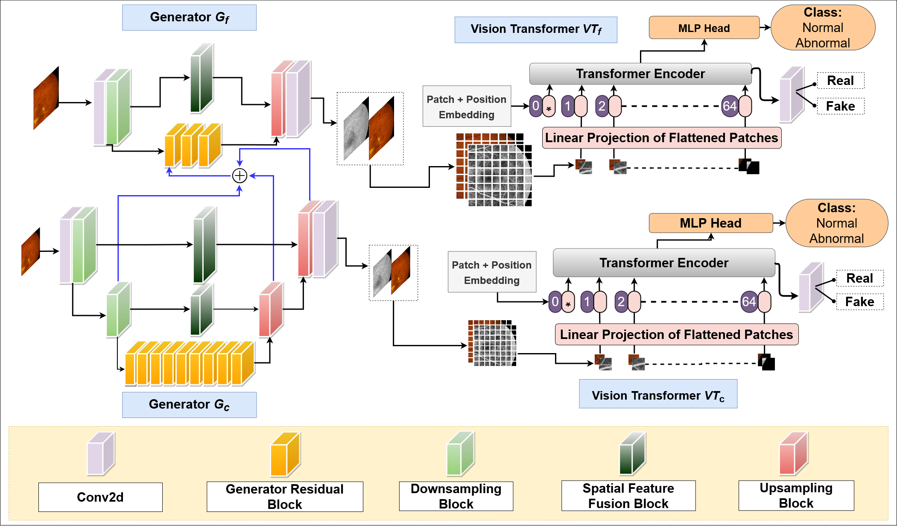

# ICCV Workshop 2021 VTGAN

[](https://paperswithcode.com/sota/fundus-to-angiography-generation-on-fundus?p=vtgan-semi-supervised-retinal-image-synthesis)

This code is for our paper "VTGAN: Semi-supervised Retinal Image Synthesis and Disease Prediction using Vision Transformers" which is part of the supplementary materials for **ICCV 2021 Workshop on Computer Vision for Automated Medical Diagnosis**. The paper has since been accpeted and presented at **ICCV 2021 Workshop**.




### Arxiv Pre-print
```
https://arxiv.org/abs/2104.06757
```
### CVF ICCVW 2021
```
https://openaccess.thecvf.com/content/ICCV2021W/CVAMD/html/Kamran_VTGAN_Semi-Supervised_Retinal_Image_Synthesis_and_Disease_Prediction_Using_Vision_ICCVW_2021_paper.html
```
### IEE Xplore ICCVW 2021
```
https://ieeexplore.ieee.org/document/9607858
```
# Citation 
```
@INPROCEEDINGS{9607858,
  author={Kamran, Sharif Amit and Hossain, Khondker Fariha and Tavakkoli, Alireza and Zuckerbrod, Stewart Lee and Baker, Salah A.},
  booktitle={2021 IEEE/CVF International Conference on Computer Vision Workshops (ICCVW)}, 
  title={VTGAN: Semi-supervised Retinal Image Synthesis and Disease Prediction using Vision Transformers}, 
  year={2021},
  volume={},
  number={},
  pages={3228-3238},
  doi={10.1109/ICCVW54120.2021.00362}
}
```

## For Pytorch version please check the following repo
```
https://github.com/Tinysqua/VTGAN-pytorch-version
```
## Pre-requisite
- Ubuntu 18.04 / Windows 7 or later
- NVIDIA Graphics card

## Installation Instruction for Ubuntu
- Download and Install [Nvidia Drivers](https://www.nvidia.com/Download/driverResults.aspx/142567/en-us)
- Download and Install via Runfile [Nvidia Cuda Toolkit 11.2](https://developer.nvidia.com/cuda-downloads?target_os=Linux&target_arch=x86_64&Distribution=Ubuntu&target_version=18.04&target_type=runfile_local)
- Download and Install [Nvidia CuDNN 8.1.0 or later](https://developer.nvidia.com/rdp/cudnn-archive)
- Install Pip3 and Python3 enviornment
```
sudo add-apt-repository ppa:deadsnakes/ppa
sudo apt install python3.7
```
- Install Tensorflow-Gpu version-2.5.0 and Keras version-2.5.0
```
sudo pip3 install tensorflow-gpu
sudo pip3 install keras
```
- Install packages from requirements.txt
```
sudo pip3 install -r requirements.txt
```

### Dataset download link for Hajeb et al.
```
https://sites.google.com/site/hosseinrabbanikhorasgani/datasets-1/fundus-fluorescein-angiogram-photographs--colour-fundus-images-of-diabetic-patients
```
- Please cite the paper if you use their data
```
@article{hajeb2012diabetic,
  title={Diabetic retinopathy grading by digital curvelet transform},
  author={Hajeb Mohammad Alipour, Shirin and Rabbani, Hossein and Akhlaghi, Mohammad Reza},
  journal={Computational and mathematical methods in medicine},
  volume={2012},
  year={2012},
  publisher={Hindawi}
}
```
- Folder structure for data-preprocessing given below. Please make sure it matches with your local repository.
```
├── Dataset
|   ├──ABNORMAL
|   ├──NORMAL
```
### Dataset Pre-processing

- Type this in terminal to run the random_crop.py file
```
python3 random_crop.py --output_dir=data --input_dim=512 --datadir=Dataset
```
- There are different flags to choose from. Not all of them are mandatory.
```
    '--input_dim', type=int, default=512
    '--n_crops', type=int, default=50
    '--datadir', type=str, required=True, help='path/to/data_directory',default='Dataset'
    '--output_dir', type=str, default='data'   
```

### NPZ file conversion
- Convert all the images to npz format
```
python3 convert_npz.py --outfile_name=vtgan --input_dim=512 --datadir=data --n_crops=50
```
- There are different flags to choose from. Not all of them are mandatory.
```
    '--input_dim', type=int, default=512
    '--n_crops', type=int, default=50
    '--datadir', type=str, required=True, help='path/to/data_directory',default='data'
    '--outfile_name', type=str, default='vtgan'
    '--n_images', type=int, default=17
```

## Training

- Type this in terminal to run the train.py file
```
python3 train.py --npz_file=vtgan --batch=2 --epochs=100 --savedir=VTGAN
```
- There are different flags to choose from. Not all of them are mandatory

```
    '--epochs', type=int, default=100
    '--batch_size', type=int, default=2
    '--npz_file', type=str, default='vtgan', help='path/to/npz/file'
    '--input_dim', type=int, default=512
    '--n_patch', type=int, default=64
    '--savedir', type=str, required=False, help='path/to/save_directory',default='VTGAN'
    '--resume_training', type=str, required=False,  default='no', choices=['yes','no']
```

# License
The code is released under the BSD 3-Clause License, you can read the license file included in the repository for details.

